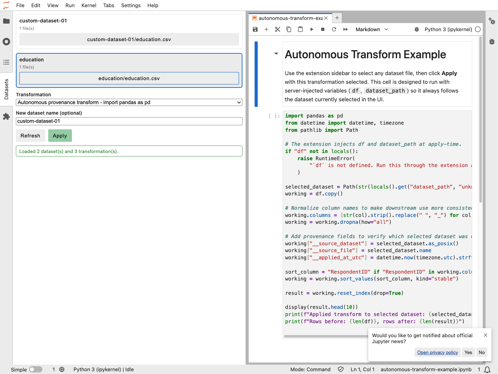

[](https://jupyter.org/)
[](https://www.python.org/)
[](https://pandas.pydata.org/)

<p align="center">
  
</p>

# jupyter-dataset

JupyterLab dataset loading helper with a simple sidebar flow: pick a dataset, choose a notebook, and apply.

Apply appends a code cell to the selected notebook:

```python
from notebooks_data import Dataset

loaded_dataset = Dataset.get("<dataset-name>").read_table(format="pandas")
```

Supported loader formats in the sidebar: `pandas` (default), `numpy`.

## Prerequisites

- Python 3.10+
- JupyterLab 4+
- `pip` and `npm` available on your machine

## Start Up

```bash
./run-jupyterlab-test.sh
```

## Optional Notebook Widget

After JupyterLab starts, run this in a notebook cell:

```python
from ipywidget.example_dataset_explorer import display_dataset_explorer; display_dataset_explorer()
```
