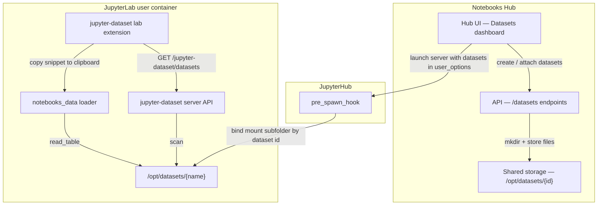

# JupyterLab Datasets Sidebar

This document explains how the **Datasets** left sidebar in JupyterLab works in Notebooks Hub, how the pieces fit together, and how to get it running locally for development.

The sidebar is **not** part of the Notebooks Hub web UI. It is a separate JupyterLab extension called [`jupyter-dataset`](https://github.com/PolusAI/jupyterlab-extensions/tree/main/jupyter-dataset), developed in the `jupyterlab-extensions` repo. Notebooks Hub provides the dataset storage and mount plumbing; the extension provides the JupyterLab UI and server API.

## What you see in JupyterLab

After the extension is installed and datasets are mounted under `/opt/datasets`, JupyterLab shows a **Datasets** panel in the left sidebar. From there you can:

1. Browse datasets attached to your server (each dataset is a folder with CSV/TSV/Parquet/JSON files).
2. Choose a loader format (`pandas` or `numpy`).
3. **Copy snippet** — copy loader code to the clipboard for pasting into any notebook cell.

Example copied snippet:

```python
from notebooks_data import Dataset

loaded_dataset = Dataset.get("Test_Dataset").read_table(format="pandas")
```

The `notebooks_data` Python package ships with the extension and reads files from the same dataset root the sidebar uses.

## Architecture



## How the pieces connect

### 1. Notebooks Hub creates and stores datasets

When a user creates a dataset in the Hub UI, the API:

- Persists dataset metadata in MongoDB.
- Creates a folder on shared storage at `/opt/datasets/{dataset-id}` (see `DATASET_LOCATION` / `datasetsPath` config).
- Manages access with OpenFGA.

Relevant code:

- `packages/API/src/controllers/datasets.controller.ts` — REST API and folder creation.
- `packages/UI/src/app/components/dashboard/datasets/` — Hub dashboard (separate from the JupyterLab sidebar).

### 2. Datasets are attached when a server is launched

When a user launches a JupyterLab server and selects datasets (via server wizard or template), the API passes them to JupyterHub as `user_options.datasets`:

```json
[
  { "id": "<mongo-id>", "name": "Test_Dataset", "write_access": false }
]
```

See `packages/API/src/services/jupyterhub.service.ts` (`createServer` → `datasets: '{datasets}'`).

### 3. JupyterHub mounts datasets into the user container

On spawn, JupyterHub bind-mounts each dataset into the JupyterLab container at `/opt/datasets/{name}`.

**Docker Compose (local dev)** — `deploy/Compose/jupyterhub_config.py`:

```python
datasets = parse_datasets(spawner.user_options.get("datasets", []))
datasets_host_base = os.environ.get("DATASETS_HOST_PATH")
if datasets and datasets_host_base:
    for dataset in datasets:
        host_path = os.path.join(datasets_host_base, dataset_id)
        mount_path = f"/opt/datasets/{dataset_name}"
        # read-only or read-write depending on write_access
```

`DATASETS_HOST_PATH` is set by `deploy/Compose/launch-notebooks-hub.sh` to the host path of `deploy/Compose/Volumes/datasets`.

**Helm / Kubernetes (production)** — `deploy/Helm/jupyterhub/files/hub/jupyterhub-config.py` mounts a shared PVC subpath `{dataset.id}` to `/opt/datasets/{dataset.name}`.

The API writes files to `/opt/datasets/{id}`; JupyterHub exposes them inside the user pod under the human-readable dataset **name**.

### 4. The `jupyter-dataset` extension adds the sidebar

The extension lives outside this repo:

```
~/Projects/jupyterlab-extensions/jupyter-dataset/
```

It has two parts:

| Part | Package | Role |
|------|---------|------|
| Frontend | `jupyter-dataset` lab extension (`src/index.ts`) | Adds the **Datasets** widget to JupyterLab's left sidebar |
| Backend | `jupyter_dataset` server extension (`jupyter_dataset/handlers.py`) | REST API under `/jupyter-dataset/*` |
| Loader | `notebooks_data` | Python helper used in generated notebook cells |

**Server API routes** (registered at Jupyter server startup):

| Route | Method | Purpose |
|-------|--------|---------|
| `/jupyter-dataset/datasets` | GET | List folders/files under `JUPYTER_DATASET_ROOT` (default `/opt/datasets`) |

**Environment variable:**

- `JUPYTER_DATASET_ROOT` — directory scanned for datasets (defaults to `/opt/datasets`).

Supported file types: `.csv`, `.tsv`, `.parquet`, `.json`, `.jsonl`.

### 5. The extension is not in the base notebook image yet

The JupyterLab image used by Notebooks Hub (`polusai/notebook:2.1.3`, configured in `deploy/Compose/jupyterhub_config.py`) does **not** include `jupyter-dataset`. The image packages many other lab extensions (see `deploy/Docker/app-stacks/notebook/values.yaml`), but `jupyter-dataset` must be installed manually into each running user container until it is baked into a future notebook image release.

## Local development setup

### Prerequisites

- Docker Desktop running
- Node.js and npm
- Both repos cloned:
  - `~/Projects/notebooks-hub`
  - `~/Projects/jupyterlab-extensions/jupyter-dataset`

### Step 1 — Start Notebooks Hub

From the `notebooks-hub` repo:

```bash
bash deploy/Compose/launch-notebooks-hub.sh -m dev
npm run start:api
npm run start:ui
```

Open http://localhost:4200, log in, and create or select a dataset in the Hub **Datasets** tab. Place data files under:

```
deploy/Compose/Volumes/datasets/<dataset-id>/
```

(for example `data.csv`).

### Step 2 — Launch JupyterLab with a dataset attached

1. Go to **Servers** in the Hub UI.
2. Launch a JupyterLab server.
3. Attach at least one dataset in the launch wizard.
4. Open the JupyterLab session from Hub.

### Step 3 — Install the extension into the running container

From the `jupyter-dataset` repo:

```bash
cd ~/Projects/jupyterlab-extensions/jupyter-dataset

# One-time setup
python3 -m venv .venv
source .venv/bin/activate
python -m pip install --upgrade pip setuptools wheel
pip install -e ".[test]"
npm install
npm run build

# Install into the running JupyterLab container and restart it
./install-into-notebooks-hub.sh
```

The install script:

1. Finds the running `jupyter-*` Docker container.
2. Copies the extension source into the container and runs `pip install`.
3. Enables the server and lab extensions.
4. Restarts the container so server routes are registered.

Then **hard-refresh** JupyterLab in the browser (`Cmd+Shift+R` on macOS).

### Step 4 — Verify

- The left sidebar should show **Datasets**.
- Click **Refresh** — status should report loaded datasets (not HTML/404).
- Select a dataset and click **Copy snippet**.

## Standalone extension testing (without Notebooks Hub)

For faster iteration on the extension UI itself:

```bash
cd ~/Projects/jupyterlab-extensions/jupyter-dataset
./run-jupyterlab-test.sh
```

This uses local sample data in `.sample-datasets/` (gitignored). Create it once with a folder per dataset:

```bash
mkdir -p .sample-datasets/Test_Dataset
cat > .sample-datasets/Test_Dataset/data.csv <<'EOF'
id,name,value
1,alpha,10.5
2,beta,22.0
3,gamma,8.75
EOF
```

## Troubleshooting

| Symptom | Likely cause | Fix |
|---------|--------------|-----|
| No **Datasets** tab in JupyterLab | Extension not installed in container | Run `./install-into-notebooks-hub.sh` and hard-refresh |
| Status shows HTML / `404 : Not Found` | Server extension not loaded (installed after server start, or container not restarted) | Re-run install script (it restarts the container) or stop/start server from Hub after installing |
| Sidebar shows "No datasets found" | Nothing under `/opt/datasets` in the container | Confirm dataset files exist; check mount wiring (see below) |
| Extension disappears after Hub server restart | New container spawned from base image without extension | Re-run `./install-into-notebooks-hub.sh` after each relaunch |
| Dataset attached in UI but `/opt/datasets` empty in dev | `DATASETS_HOST_PATH` may not reach the JupyterHub container in `-m dev` | Copy test data manually: `docker cp ... "$CONTAINER:/opt/datasets/<name>/data.csv"` |

### Manual dataset copy workaround (dev mode)

```bash
CONTAINER=$(docker ps --filter "name=jupyter-" --format "{{.Names}}" | head -1)

docker exec -u root "$CONTAINER" mkdir -p /opt/datasets/Test_Dataset
docker cp path/to/data.csv "$CONTAINER:/opt/datasets/Test_Dataset/data.csv"
```

### Confirm the server API is up

After install and container restart, Jupyter server logs should include:

```
Registered jupyter-dataset server extension
jupyter_dataset | extension was successfully loaded.
```

If the server started **before** the extension was installed, logs may show:

```
jupyter_dataset | error adding extension: No module named 'jupyter_dataset'
```

Restart the user container or relaunch the server from Hub after installing.

## Known follow-ups

- **Bake `jupyter-dataset` into `polusai/notebook`** — avoids reinstalling on every server relaunch.
- **Pass `DATASETS_HOST_PATH` into the JupyterHub container in Compose dev mode** — so dataset bind mounts from Hub UI work without manual `docker cp`.
- **Publish the extension** — track progress in [PolusAI/jupyterlab-extensions](https://github.com/PolusAI/jupyterlab-extensions) (PR #53 added the extension; issue #54 covers Copy snippet).

## Related files in this repo

| File | Role |
|------|------|
| `deploy/Compose/jupyterhub_config.py` | Docker bind mounts for datasets on spawn |
| `deploy/Compose/launch-notebooks-hub.sh` | Sets `DATASETS_HOST_PATH` for host-side dataset volume |
| `deploy/Helm/jupyterhub/files/hub/jupyterhub-config.py` | Kubernetes PVC subpath mounts |
| `packages/API/src/controllers/datasets.controller.ts` | Dataset CRUD and `/opt/datasets/{id}` folder creation |
| `packages/API/src/services/jupyterhub.service.ts` | Passes `datasets` in spawn options |
| `deploy/Docker/app-stacks/notebook/values.yaml` | Base JupyterLab image packages (extension not yet included) |

## Related files in `jupyter-dataset`

| File | Role |
|------|------|
| `src/index.ts` | Sidebar UI plugin |
| `jupyter_dataset/handlers.py` | Server REST handlers |
| `notebooks_data/dataset.py` | Python loader used in notebook cells |
| `install-into-notebooks-hub.sh` | Install helper for Compose dev |
| `run-jupyterlab-test.sh` | Standalone local test launcher |
