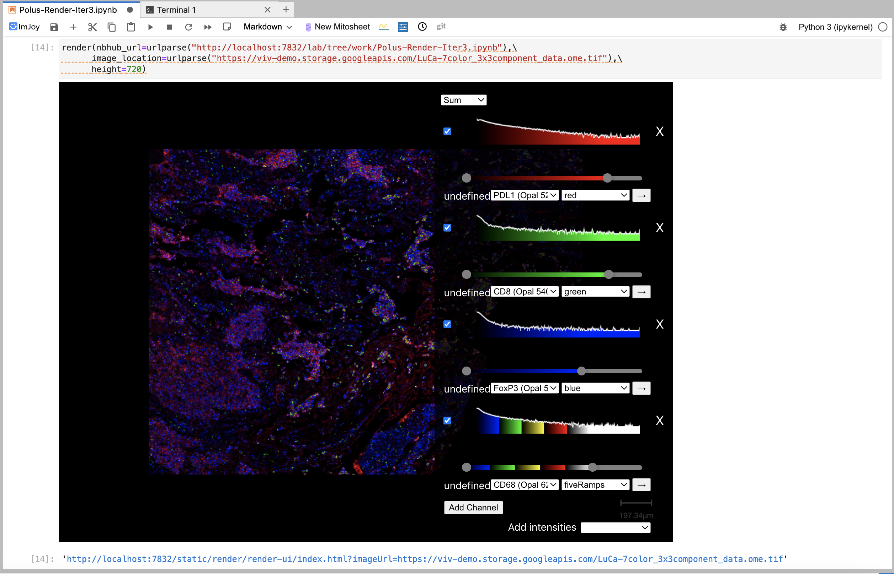

# Jupyterlab Polus Render

JupyterLab Polus Render makes Polus Render available as a JupyterLab extension. 

Polus Render allows visualizing tiled raster datasets in Zarr and TIFF formats, as well as vector overlays in MicroJSON format. It uses lookup tables to map intensity values in these datasets to colors.

The are three ways to load the data:
1. Specifying a URL to the server serving the data.
2. Specifying a local path to a file from JupyterLab.
3. Dragging-and-dropping the dataset.
</br>



## Requirements

* JupyterLab >= 4.0

## Install

You can install using `pip`:

```bash
pip install jupyterlab_polus_render
```

## Uninstall

To remove the extension, execute:

```bash
pip uninstall jupyterlab_polus_render
```

## Troubleshoot

If you are seeing the frontend extension, but it is not working, check
that the server extension is enabled:

```bash
jupyter server extension list
```

If the server extension is installed and enabled, but you are not seeing
the frontend extension, check the frontend extension is installed:

```bash
jupyter labextension list
```

## Sample usage
```Python
import jupyterlab_polus_render

# Initiates the static build of Render with height of iFrame window set to 900px.
jupyterlab_polus_render.Render(height = 900)

# Serves a tiff image by providing the local path. 
jupyterlab_polus_render.Render(imagePath = 'images/LuCa-7color_3x3component_data.ome.tif', height = 900)

# Serves a tiff image by providing the local path along with an overlay used for the image. 
jupyterlab_polus_render.Render(imagePath = 'images/LuCa-7color_3x3component_data.ome.tif', overlayPath = 'images/overlay_render2.json', height = 900)

# Embeds an iFrame of a static build of Polus Render with remote image
jupyterlab_polus_render.Render(imagePath = 'https://viv-demo.storage.googleapis.com/LuCa-7color_3x3component_data.ome.tif', height = 900)

# Serves a zarr dataset by providing the local path along with an overlay used for the dataset. 
jupyterlab_polus_render.Render(imagePath = 'images/pyramid.zarr', overlayPath = 'images/overlay_render2.json', height = 900)

```

## Contributing
### Development Install

Create a dev environment:
```bash
conda create -n jupyterlab_polus_render-dev -c conda-forge nodejs python jupyterlab=4.0.11
conda activate jupyterlab_polus_render-dev
```

```bash
# Clone the repo to your local environment
# Change directory to the jupyterlab_polus_render directory
# Install package in development mode
pip install -e .
# Link your development version of the extension with JupyterLab
jupyter labextension develop . --overwrite
# Server extension must be manually installed in develop mode
jupyter server extension enable jupyterlab_polus_render
# Rebuild extension Typescript source after making changes
jlpm run build
```

### How to see your changes
#### Typescript:
If you use JupyterLab to develop then you can watch the source directory and run JupyterLab at the same time in different
terminals to watch for changes in the extension's source and automatically rebuild the widget.

```bash
# Watch the source directory in one terminal, automatically rebuilding when needed
jlpm run watch
# Run JupyterLab in another terminal
jupyter lab
```

After a change wait for the build to finish and then refresh your browser and the changes should take effect.

#### Python:
If you make a change to the python code then you will need to restart the notebook kernel to have it take effect.


### Development uninstall

```bash
# Server extension must be manually disabled in develop mode
jupyter server extension disable jupyterlab_polus_render
pip uninstall jupyterlab_polus_render
```

In development mode, you will also need to remove the symlink created by `jupyter labextension develop`
command. To find its location, you can run `jupyter labextension list` to figure out where the `labextensions`
folder is located. Then you can remove the symlink named `jupyterlab_polus_render` within that folder.
