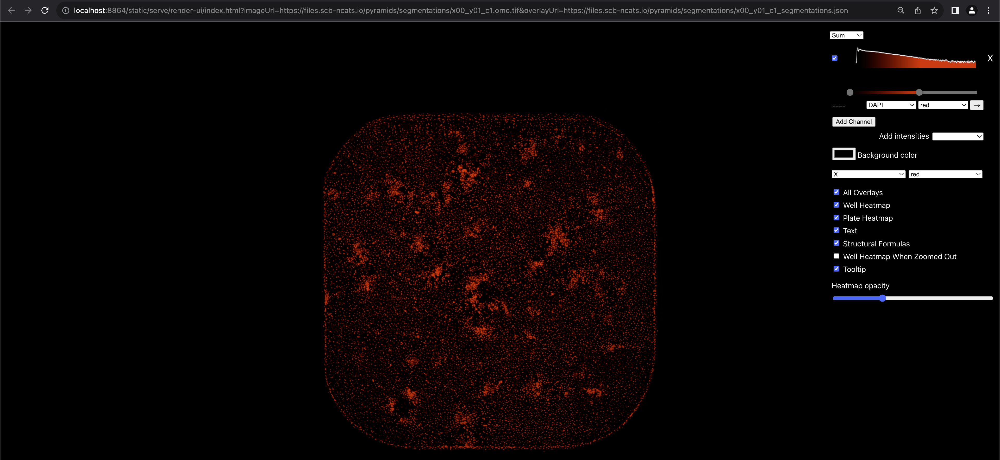
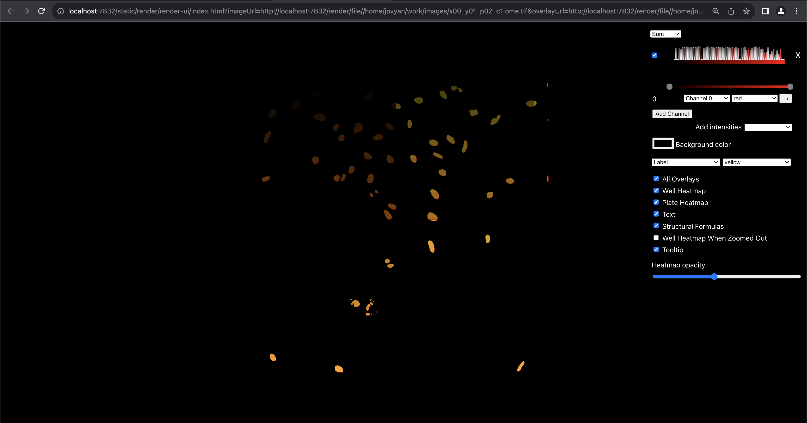
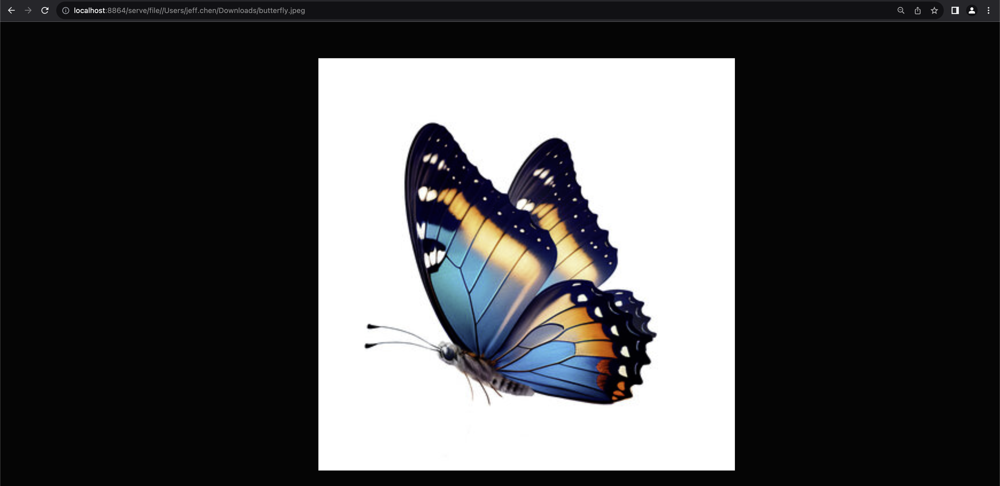
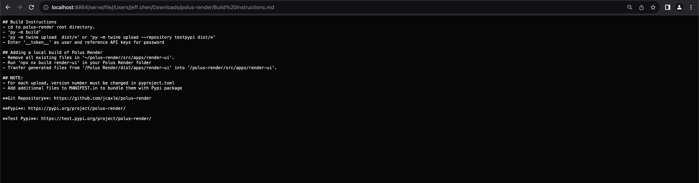

# Render Server Ext
Jupyter Server Extension serves files and provides a static build of Polus Render.

# Requirements
- Jupyter Server 2.7.0

# Adding a static build of Polus Render
- Remove all existing files in `~/render-server-ext/static/render-ui/`. 
- Run `npx nx build render-ui` in the root of your Polus Render folder
- Transfer generated files from `~/Polus Render/dist/apps/render-ui/` into `~/render-server-ext/static/render-ui/`. 

# API Endpoints
- `/render/default/(.*)`: Help on usage of extension
- `/static/render/render-ui/index.html`: Serves static build of Polus Render.
- `/render/file/(.+)`: Serves files at a specfied path. Does not serve directories.

# Examples
For the following examples, JupyterLab is ran locally at `https://localhost:7832/lab`

## Render-UI 
URL: `http://localhost:7832/static/render/render-ui/index.html?imageUrl=http://localhost:7832/render/file//home/jovyan/work/images/4by4large_intensity_image.ome.tif`

URL: `http://localhost:7832/static/render/render-ui/index.html?imageUrl=http://localhost:7832/render/file//home/jovyan/work/images/x00_y01_p02_c1.ome.tif&overlayUrl=http://localhost:7832/render/file//home/jovyan/work/overlays/combined.json`

## Image
URL: `http://localhost:7832/render/file/home/jovyan/work/samples/butterfly.jpeg`

## Markdown
URL: `http://localhost:7832/render/file/home/jovyan/work/samples/README.md`

